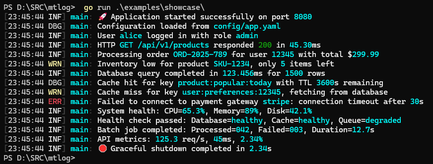

# mtlog - Message Template Logging for Go

[](https://pkg.go.dev/github.com/willibrandon/mtlog)
[](https://opensource.org/licenses/MIT)

mtlog is a high-performance structured logging library for Go, inspired by [Serilog](https://serilog.net/). It brings message templates and pipeline architecture to the Go ecosystem, achieving zero allocations for simple logging operations while providing powerful features for complex scenarios.

## Features

### Core Features
- **Zero-allocation logging** for simple messages (17.3 ns/op)
- **Message templates** with positional property extraction and format specifiers
- **Go template syntax** support (`{{.Property}}`) alongside traditional syntax
- **Output templates** for customizable log formatting
- **Source context enrichment** with intelligent caching for automatic logger categorization
- **Pipeline architecture** for clean separation of concerns
- **Type-safe generics** for better compile-time safety
- **LogValue interface** for safe logging of sensitive data
- **7.7x faster** than zap for simple string logging
- **Standard library compatibility** via slog.Handler adapter (Go 1.21+)
- **Kubernetes ecosystem** support via logr.LogSink adapter

### Sinks & Output
- **Console sink** with customizable themes (dark, light, ANSI, Literate)
- **File sink** with rolling policies (size, time-based)
- **Seq integration** with CLEF format and dynamic level control
- **Elasticsearch sink** for centralized log storage and search
- **Splunk sink** with HEC (HTTP Event Collector) support
- **Async sink wrapper** for high-throughput scenarios
- **Durable buffering** with persistent storage for reliability

### Pipeline Components
- **Rich enrichment** with built-in and custom enrichers
- **Advanced filtering** including rate limiting and sampling
- **Minimum level overrides** by source context patterns
- **Type-safe destructuring** with caching for performance
- **Dynamic level control** with runtime adjustments
- **Configuration from JSON** for flexible deployment

## Installation

```bash
go get github.com/willibrandon/mtlog
```

## Quick Start

```go
package main

import (
    "github.com/willibrandon/mtlog"
    "github.com/willibrandon/mtlog/core"
)

func main() {
    // Create a logger with console output
    log := mtlog.New(
        mtlog.WithConsoleProperties(),
        mtlog.WithMinimumLevel(core.InformationLevel),
    )

    // Simple logging
    log.Information("Application started")
    
    // Message templates with properties
    userId := 123
    log.Information("User {UserId} logged in", userId)
    
    // Destructuring complex types
    order := Order{ID: 456, Total: 99.95}
    log.Information("Processing {@Order}", order)
}

// For libraries that need error handling:
func NewLibraryLogger() (*mtlog.Logger, error) {
    return mtlog.Build(
        mtlog.WithConsoleTemplate("[{Timestamp:HH:mm:ss} {Level:u3}] {Message}"),
        mtlog.WithMinimumLevel(core.DebugLevel),
    )
}
```

## Visual Example



## Message Templates

mtlog uses message templates that preserve structure throughout the logging pipeline:

```go
// Properties are extracted positionally
log.Information("User {UserId} logged in from {IP}", userId, ipAddress)

// Go template syntax is also supported
log.Information("User {{.UserId}} logged in from {{.IP}}", userId, ipAddress)

// Mix both syntaxes as needed
log.Information("User {UserId} ({{.Username}}) from {IP}", userId, username, ipAddress)

// Destructuring hints:
// @ - destructure complex types into properties
log.Information("Order {@Order} created", order)

// $ - force scalar rendering (stringify)
log.Information("Error occurred: {$Error}", err)

// Format specifiers
log.Information("Processing time: {Duration:F2}ms", 123.456)
log.Information("Disk usage at {Percentage:P1}", 0.85)  // 85.0%
log.Information("Order {OrderId:000} total: ${Amount:F2}", 42, 99.95)
```

## Output Templates

Control how log events are formatted for output with customizable templates:

```go
// Console with custom output template
log := mtlog.New(
    mtlog.WithConsoleTemplate("[{Timestamp:HH:mm:ss} {Level:u3}] {SourceContext}: {Message}"),
    mtlog.WithConsoleTheme(sinks.LiterateTheme()),
)

// File with detailed template
log := mtlog.New(
    mtlog.WithFileTemplate("app.log", 
        "[{Timestamp:yyyy-MM-dd HH:mm:ss.fff zzz} {Level:u3}] {SourceContext}: {Message}{NewLine}{Exception}"),
)
```

### Template Properties
- `{Timestamp}` - Event timestamp with optional format
- `{Level}` - Log level with format options (u3, u, l)
- `{Message}` - Rendered message from template
- `{SourceContext}` - Logger context/category
- `{Exception}` - Exception details if present
- `{NewLine}` - Platform-specific line separator
- Custom properties by name: `{RequestId}`, `{UserId}`, etc.

### Format Specifiers
- **Timestamps**: `HH:mm:ss`, `yyyy-MM-dd`, `HH:mm:ss.fff`
- **Levels**: `u3` (INF), `u` (INFORMATION), `l` (information)
- **Numbers**: `000` (zero-pad), `F2` (2 decimals), `P1` (percentage)

## Pipeline Architecture

The logging pipeline processes events through distinct stages:

```
Message Template Parser → Enrichment → Filtering → Destructuring → Output
```

### Configuration with Functional Options

```go
log := mtlog.New(
    // Output configuration
    mtlog.WithConsoleTheme("dark"),     // Console with dark theme
    mtlog.WithRollingFile("app.log", 10*1024*1024), // Rolling file (10MB)
    mtlog.WithSeq("http://localhost:5341", "api-key"), // Seq integration
    
    // Enrichment
    mtlog.WithTimestamp(),              // Add timestamp
    mtlog.WithMachineName(),            // Add hostname
    mtlog.WithProcessInfo(),            // Add process ID/name
    mtlog.WithCallersInfo(),            // Add file/line info
    
    // Filtering & Level Control
    mtlog.WithMinimumLevel(core.DebugLevel),
    mtlog.WithDynamicLevel(levelSwitch), // Runtime level control
    mtlog.WithFilter(customFilter),
    
    // Destructuring
    mtlog.WithDestructuring(),          // Enable @ hints
    mtlog.WithDestructuringDepth(5),    // Max depth
)
```

## Enrichers

Enrichers add contextual information to all log events:

```go
// Built-in enrichers
log := mtlog.New(
    mtlog.WithTimestamp(),
    mtlog.WithMachineName(),
    mtlog.WithProcessInfo(),
    mtlog.WithEnvironmentVariables("APP_ENV", "VERSION"),
    mtlog.WithThreadId(),
    mtlog.WithCallersInfo(),
    mtlog.WithCorrelationId("RequestId"),
    mtlog.WithSourceContext(), // Auto-detect logger context
)

// Context-based enrichment
ctx := context.WithValue(context.Background(), "RequestId", "abc-123")
log.ForContext("UserId", userId).Information("Processing request")

// Source context for sub-loggers
serviceLog := log.ForSourceContext("MyApp.Services.UserService")
serviceLog.Information("User service started")
```

## LogContext - Scoped Properties

LogContext provides a way to attach properties to a context that will be automatically included in all log events created from loggers using that context. Properties follow a precedence order: event-specific properties (passed directly to log methods) override ForContext properties, which override LogContext properties (set via PushProperty).

```go
// Add properties to context that flow through all operations
ctx := context.Background()
ctx = mtlog.PushProperty(ctx, "RequestId", "req-12345")
ctx = mtlog.PushProperty(ctx, "UserId", userId)
ctx = mtlog.PushProperty(ctx, "TenantId", "acme-corp")

// Create a logger that includes context properties
log := logger.WithContext(ctx)
log.Information("Processing request") // Includes all pushed properties

// Properties are inherited - child contexts get parent properties
func processOrder(ctx context.Context, orderId string) {
    // Add operation-specific properties
    ctx = mtlog.PushProperty(ctx, "OrderId", orderId)
    ctx = mtlog.PushProperty(ctx, "Operation", "ProcessOrder")
    
    log := logger.WithContext(ctx)
    log.Information("Order processing started") // Includes all parent + new properties
}

// Property precedence example
ctx = mtlog.PushProperty(ctx, "UserId", 123)
logger.WithContext(ctx).Information("Test")                          // UserId=123
logger.WithContext(ctx).ForContext("UserId", 456).Information("Test") // UserId=456 (ForContext overrides)
logger.WithContext(ctx).Information("User {UserId}", 789)            // UserId=789 (event property overrides all)
```

This is particularly useful for:
- Request tracing in web applications
- Maintaining context through async operations
- Multi-tenant applications
- Batch processing with job-specific context

## Filters

Control which events are logged with powerful filtering:

```go
// Level filtering
mtlog.WithMinimumLevel(core.WarningLevel)

// Minimum level overrides by source context
mtlog.WithMinimumLevelOverrides(map[string]core.LogEventLevel{
    "github.com/gin-gonic/gin":       core.WarningLevel,    // Suppress Gin info logs
    "github.com/go-redis/redis":      core.ErrorLevel,      // Only Redis errors
    "myapp/internal/services":        core.DebugLevel,      // Debug for internal services
    "myapp/internal/services/auth":   core.VerboseLevel,    // Verbose for auth debugging
})

// Custom predicate
mtlog.WithFilter(filters.NewPredicateFilter(func(e *core.LogEvent) bool {
    return !strings.Contains(e.MessageTemplate.Text, "health-check")
}))

// Rate limiting
mtlog.WithFilter(filters.NewRateLimitFilter(100, time.Minute))

// Statistical sampling
mtlog.WithFilter(filters.NewSamplingFilter(0.1)) // 10% of events

// Property-based filtering
mtlog.WithFilter(filters.NewExpressionFilter("UserId", 123))
```

## Sinks

mtlog supports multiple output destinations with advanced features:

### Console Sink with Themes

```go
// Literate theme - beautiful, easy on the eyes
mtlog.WithConsoleTheme(sinks.LiterateTheme())

// Dark theme (default)
mtlog.WithConsoleTheme(sinks.DarkTheme())

// Light theme
mtlog.WithConsoleTheme(sinks.LightTheme()) 

// Plain text (no colors)
mtlog.WithConsoleTheme(sinks.NoColorTheme())
```

### File Sinks

```go
// Simple file output
mtlog.WithFileSink("app.log")

// Rolling file by size
mtlog.WithRollingFile("app.log", 10*1024*1024) // 10MB

// Rolling file by time
mtlog.WithRollingFileTime("app.log", time.Hour) // Every hour
```

### Seq Integration

```go
// Basic Seq integration
mtlog.WithSeq("http://localhost:5341")

// With API key
mtlog.WithSeq("http://localhost:5341", "your-api-key")

// Advanced configuration
mtlog.WithSeqAdvanced("http://localhost:5341",
    sinks.WithSeqBatchSize(100),
    sinks.WithSeqBatchTimeout(5*time.Second),
    sinks.WithSeqCompression(true),
)

// Dynamic level control via Seq
levelOption, levelSwitch, controller := mtlog.WithSeqLevelControl(
    "http://localhost:5341",
    mtlog.SeqLevelControllerOptions{
        CheckInterval: 30*time.Second,
        InitialCheck: true,
    },
)
```

### Elasticsearch Integration

```go
// Basic Elasticsearch
mtlog.WithElasticsearch("http://localhost:9200", "logs")

// With authentication
mtlog.WithElasticsearchAdvanced(
    []string{"http://localhost:9200"},
    elasticsearch.WithIndex("myapp-logs"),
    elasticsearch.WithAPIKey("api-key"),
    elasticsearch.WithBatchSize(100),
)
```

### Splunk Integration

```go
// Splunk HEC integration
mtlog.WithSplunk("http://localhost:8088", "your-hec-token")

// Advanced Splunk configuration
mtlog.WithSplunkAdvanced("http://localhost:8088",
    sinks.WithSplunkToken("hec-token"),
    sinks.WithSplunkIndex("main"),
    sinks.WithSplunkSource("myapp"),
)
```

### Async and Durable Sinks

```go
// Wrap any sink for async processing
mtlog.WithAsync(mtlog.WithFileSink("app.log"))

// Durable buffering (survives crashes)
mtlog.WithDurable(
    mtlog.WithSeq("http://localhost:5341"),
    sinks.WithDurableDirectory("./logs/buffer"),
    sinks.WithDurableMaxSize(100*1024*1024), // 100MB buffer
)
```

## Dynamic Level Control

Control logging levels at runtime without restarting your application:

### Manual Level Control

```go
// Create a level switch
levelSwitch := mtlog.NewLoggingLevelSwitch(core.InformationLevel)

logger := mtlog.New(
    mtlog.WithLevelSwitch(levelSwitch),
    mtlog.WithConsole(),
)

// Change level at runtime
levelSwitch.SetLevel(core.DebugLevel)

// Fluent interface
levelSwitch.Debug().Information().Warning()

// Check if level is enabled
if levelSwitch.IsEnabled(core.VerboseLevel) {
    // Expensive logging operation
}
```

### Centralized Level Control with Seq

```go
// Automatic level synchronization with Seq server
options := mtlog.SeqLevelControllerOptions{
    CheckInterval: 30 * time.Second,
    InitialCheck:  true,
}

loggerOption, levelSwitch, controller := mtlog.WithSeqLevelControl(
    "http://localhost:5341", options)
defer controller.Close()

logger := mtlog.New(loggerOption)

// Level changes in Seq UI automatically update your application
```

## Configuration from JSON

Configure loggers using JSON for flexible deployments:

```go
// Load from JSON file
config, err := configuration.LoadFromFile("logging.json")
if err != nil {
    log.Fatal(err)
}

logger := config.CreateLogger()
```

Example `logging.json`:
```json
{
    "minimumLevel": "Information",
    "sinks": [
        {
            "type": "Console",
            "theme": "dark"
        },
        {
            "type": "RollingFile",
            "path": "logs/app.log",
            "maxSize": "10MB"
        },
        {
            "type": "Seq",
            "serverUrl": "http://localhost:5341",
            "apiKey": "${SEQ_API_KEY}"
        }
    ],
    "enrichers": ["Timestamp", "MachineName", "ProcessInfo"]
}
```

## Safe Logging with LogValue

Protect sensitive data with the LogValue interface:

```go
type User struct {
    ID       int
    Username string
    Password string // Never logged
}

func (u User) LogValue() interface{} {
    return map[string]interface{}{
        "id":       u.ID,
        "username": u.Username,
        // Password intentionally omitted
    }
}

// Password won't appear in logs
user := User{ID: 1, Username: "alice", Password: "secret"}
log.Information("User logged in: {@User}", user)
```

## Performance

Benchmark results on AMD Ryzen 9 9950X:

| Operation | mtlog | zap | zerolog | Winner |
|-----------|-------|-----|---------|---------|
| Simple string | 16.82 ns | 146.6 ns | 36.46 ns | **mtlog** |
| Filtered out | 1.47 ns | 3.57 ns | 1.71 ns | **mtlog** |
| Two properties | 190.6 ns | 216.9 ns | 49.48 ns | zerolog |
| With context | 205.2 ns | 130.8 ns | 35.25 ns | zerolog |

## Examples

See the [examples](./examples) directory for complete examples:

- [Basic logging](./examples/basic/main.go)
- [Using enrichers](./examples/enrichers/main.go)
- [Context logging](./examples/context/main.go)
- [Advanced filtering](./examples/filtering/main.go)
- [Destructuring](./examples/destructuring/main.go)
- [LogValue interface](./examples/logvalue/main.go)
- [Console themes](./examples/themes/main.go)
- [Output templates](./examples/output-templates/main.go)
- [Go template syntax](./examples/go-templates/main.go)
- [Rolling files](./examples/rolling/main.go)
- [Seq integration](./examples/seq/main.go)
- [Elasticsearch](./examples/elasticsearch/main.go)
- [Splunk integration](./examples/splunk/main.go)
- [Async logging](./examples/async/main.go)
- [Durable buffering](./examples/durable/main.go)
- [Dynamic levels](./examples/dynamic-levels/main.go)
- [Configuration](./examples/configuration/main.go)
- [Generics usage](./examples/generics/main.go)

## Ecosystem Compatibility

### Standard Library (slog)

mtlog provides full compatibility with Go's standard `log/slog` package:

```go
// Use mtlog as a backend for slog
slogger := mtlog.NewSlogLogger(
    mtlog.WithSeq("http://localhost:5341"),
    mtlog.WithMinimumLevel(core.InformationLevel),
)

// Use standard slog API
slogger.Info("user logged in", "user_id", 123, "ip", "192.168.1.1")

// Or create a custom slog handler
logger := mtlog.New(mtlog.WithConsole())
slogger = slog.New(logger.AsSlogHandler())
```

### Kubernetes (logr)

mtlog integrates with the Kubernetes ecosystem via logr:

```go
// Use mtlog as a backend for logr
logrLogger := mtlog.NewLogrLogger(
    mtlog.WithConsole(),
    mtlog.WithMinimumLevel(core.DebugLevel),
)

// Use standard logr API
logrLogger.Info("reconciling", "namespace", "default", "name", "my-app")
logrLogger.Error(err, "failed to update resource")

// Or create a custom logr sink
logger := mtlog.New(mtlog.WithSeq("http://localhost:5341"))
logrLogger = logr.New(logger.AsLogrSink())
```

## Environment Variables

mtlog respects several environment variables for runtime configuration:

### Color Control

```bash
# Force specific color mode (overrides terminal detection)
export MTLOG_FORCE_COLOR=none     # Disable all colors
export MTLOG_FORCE_COLOR=8        # Force 8-color mode (basic ANSI)
export MTLOG_FORCE_COLOR=256      # Force 256-color mode

# Standard NO_COLOR variable is also respected
export NO_COLOR=1                 # Disable colors (follows no-color.org)
```

### Performance Tuning

```bash
# Adjust source context cache size (default: 10000)
export MTLOG_SOURCE_CTX_CACHE=50000  # Increase for large applications
export MTLOG_SOURCE_CTX_CACHE=1000   # Decrease for memory-constrained environments
```

## Tools

### mtlog-analyzer

A static analysis tool that catches common mtlog mistakes at compile time:

```bash
# Install the analyzer
go install github.com/willibrandon/mtlog/cmd/mtlog-analyzer@latest

# Run with go vet
go vet -vettool=$(which mtlog-analyzer) ./...
```

The analyzer detects:
- Template/argument count mismatches
- Invalid property names (spaces, starting with numbers)
- Duplicate properties in templates
- Missing destructuring hints for complex types
- Error logging without error values

Example catches:
```go
// ❌ Template has 2 properties but 1 argument provided
log.Information("User {UserId} logged in from {IP}", userId)

// ❌ Duplicate property 'UserId'
log.Information("User {UserId} did {Action} as {UserId}", id, "login", id)

// ❌ Using @ prefix for basic type
log.Information("Count is {@Count}", 42)

// ✅ Correct usage
log.Information("User {@User} has {Count} items", user, count)
```

See [mtlog-analyzer README](./cmd/mtlog-analyzer/README.md) for detailed documentation and CI integration.

## Advanced Usage

### Custom Sinks

Implement the `core.LogEventSink` interface for custom outputs:

```go
type CustomSink struct{}

func (s *CustomSink) Emit(event *core.LogEvent) error {
    // Process the log event
    return nil
}

log := mtlog.New(
    mtlog.WithSink(&CustomSink{}),
)
```

### Custom Enrichers

Add custom properties to all events:

```go
type UserEnricher struct {
    userID int
}

func (e *UserEnricher) Enrich(event *core.LogEvent, factory core.LogEventPropertyFactory) {
    event.AddPropertyIfAbsent(factory.CreateProperty("UserId", e.userID))
}

log := mtlog.New(
    mtlog.WithEnricher(&UserEnricher{userID: 123}),
)
```

### Type Registration

Register types for special handling during destructuring:

```go
destructurer := destructure.NewDefaultDestructurer()
destructurer.RegisterScalarType(reflect.TypeOf(uuid.UUID{}))
```

## Documentation

For comprehensive guides and examples, see the [docs](./docs) directory:

- **[Quick Reference](./docs/quick-reference.md)** - Quick reference for all features
- **[Template Syntax](./docs/template-syntax.md)** - Guide to message template syntaxes
- **[Sinks Guide](./docs/sinks.md)** - Complete guide to all output destinations
- **[Dynamic Level Control](./docs/dynamic-levels.md)** - Runtime level management
- **[Type-Safe Generics](./docs/generics.md)** - Compile-time safe logging methods
- **[Configuration](./docs/configuration.md)** - JSON-based configuration
- **[Performance](./docs/performance.md)** - Benchmarks and optimization
- **[Testing](./docs/testing.md)** - Container-based integration testing

## Testing

```bash
# Run unit tests
go test ./...

# Run integration tests with Docker Compose
docker-compose -f docker/docker-compose.test.yml up -d
go test -tags=integration ./...
docker-compose -f docker/docker-compose.test.yml down

# Run benchmarks
go test -bench=. -benchmem ./...
```

See [testing.md](./docs/testing.md) for detailed testing guide and manual container setup.

## Contributing

Contributions are welcome! Please see our [Contributing Guide](CONTRIBUTING.md) for details.

## License

This project is licensed under the MIT License - see the [LICENSE](LICENSE) file for details.
